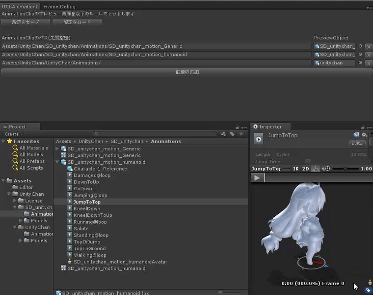

# AnimationClipInspectorExtension
AnimationClipのInspectorをルールベースで適応するオブジェクトを変えるEditor拡張です

※本プロジェクトでは Relfectionを利用して呼び出しを行っています。 
　そのため、Unityのバージョンによっては動作しない可能性があります。 
 
　動作確認バージョン:2017.3 

## 動作の様子

上のWindowで指定したルールに沿って、AnimationClipのPreviewで適応するGameObjectを変更しています。 
Windowが存在している間は、このルールに沿って AnimationClipのPreviewのモデルを変更します

## 謝辞
本プロジェクトのサンプルとして、UnityChanのデータを利用しています 

この作品はユニティちゃんライセンス条項の元に提供されています
c UTJ/UCL

